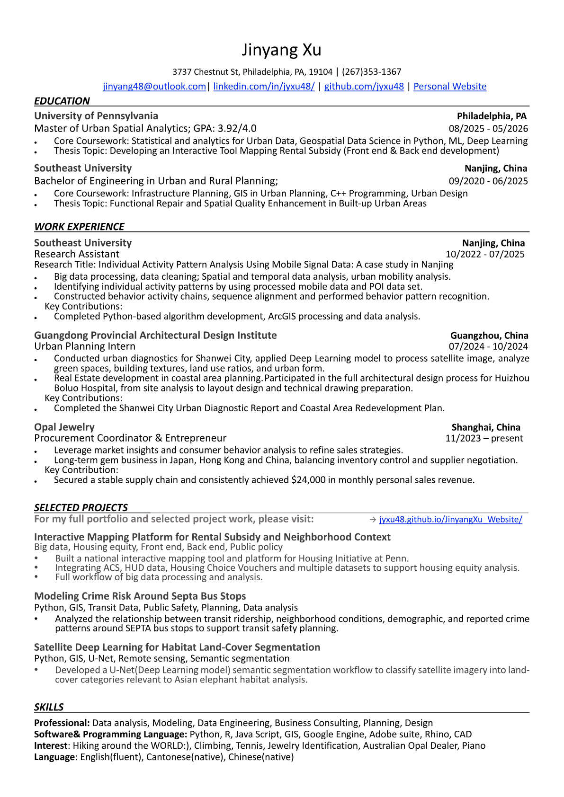

```{=html}
<div class="cv-actions">
  <a href="Resume_Jinyang_0501.pdf" target="_blank">Open Résumé in a new tab</a>
  <a href="Resume_Jinyang_0501.pdf" download>Download Résumé</a>
</div>

<div class="pdf-page-shell rendered-pdf-pages">
  
</div>
```
