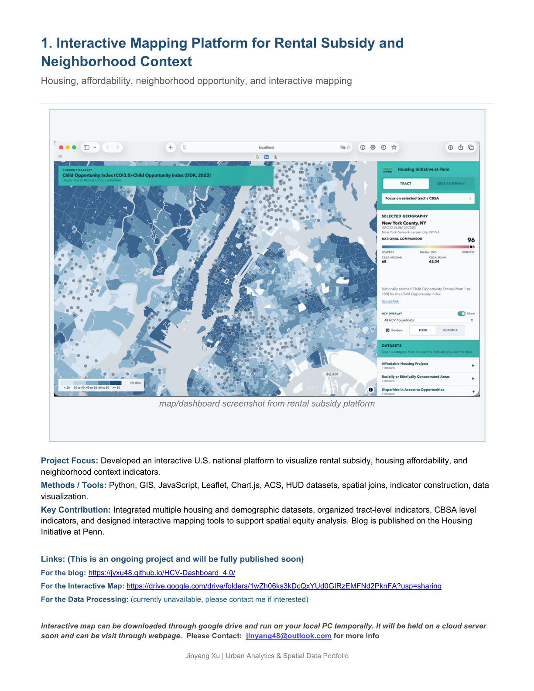
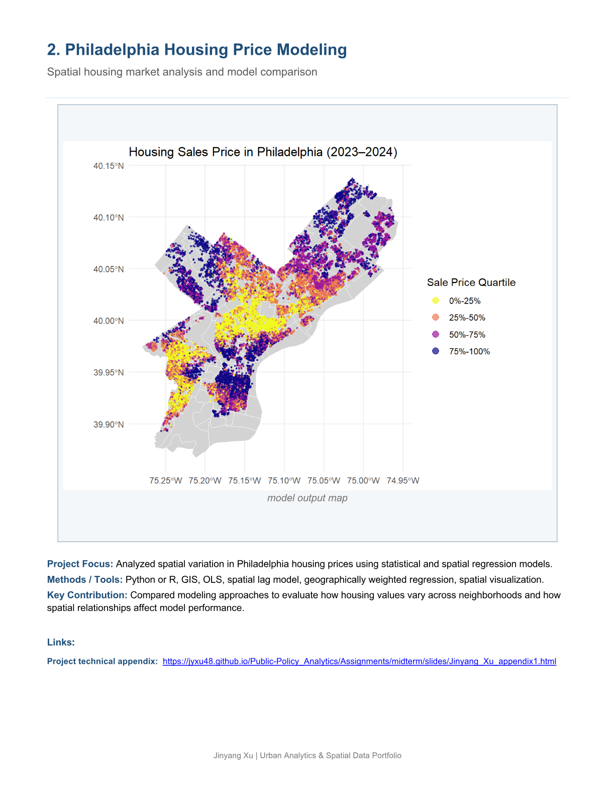
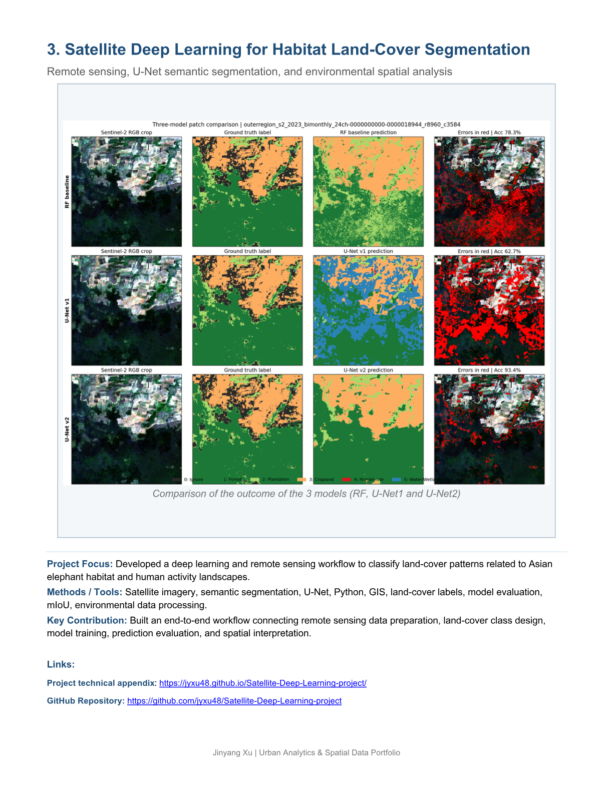
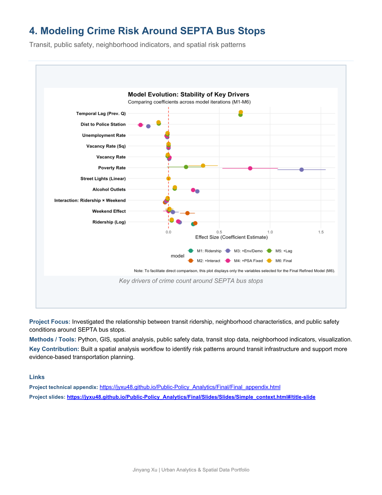
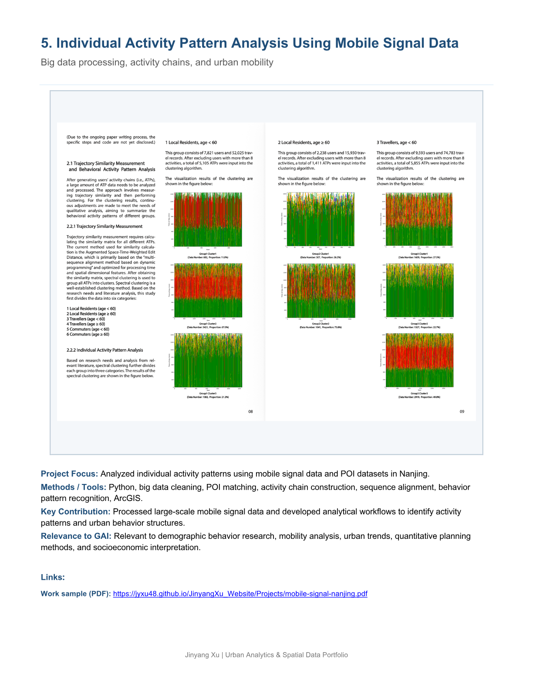
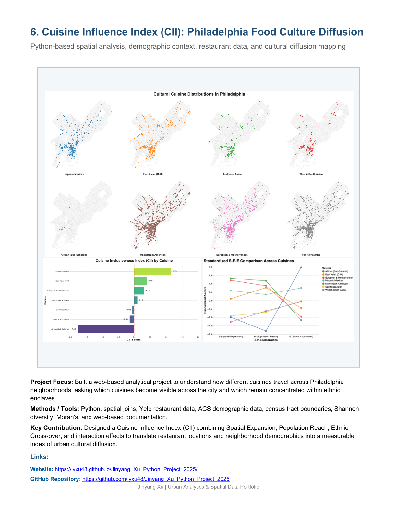
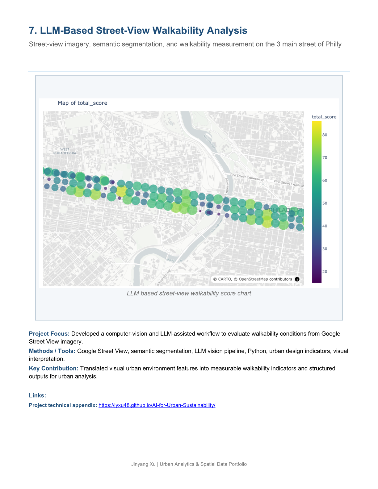

```{=html}
<div class="cv-actions">
  <a href="Jinyang_Xu_Portfolio.pdf" target="_blank">Open Portfolio PDF in a new tab</a>
  <a href="Jinyang_Xu_Portfolio.pdf" download>Download Portfolio PDF</a>
</div>

<div class="pdf-page-shell rendered-pdf-pages">
  
  
  
  
  
  
  
  
  
</div>
```
