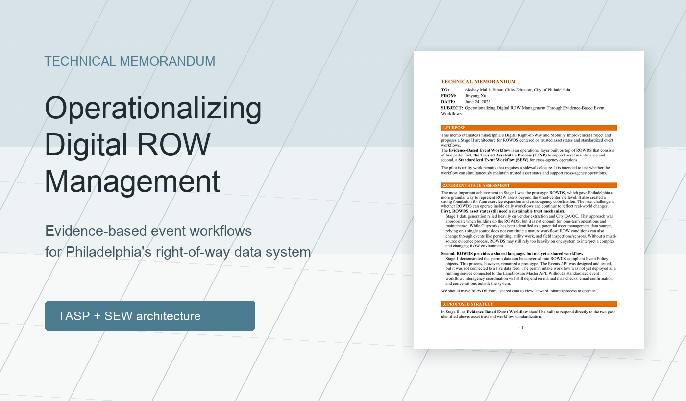
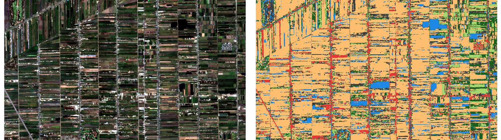
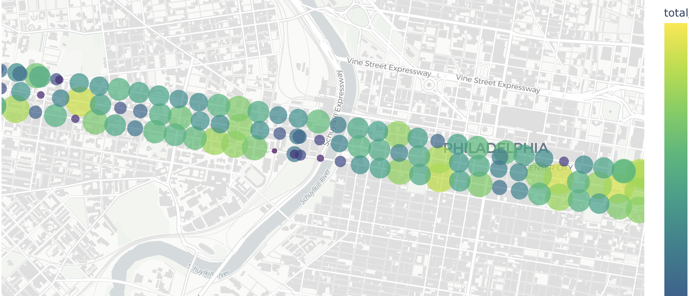
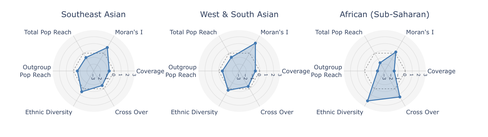
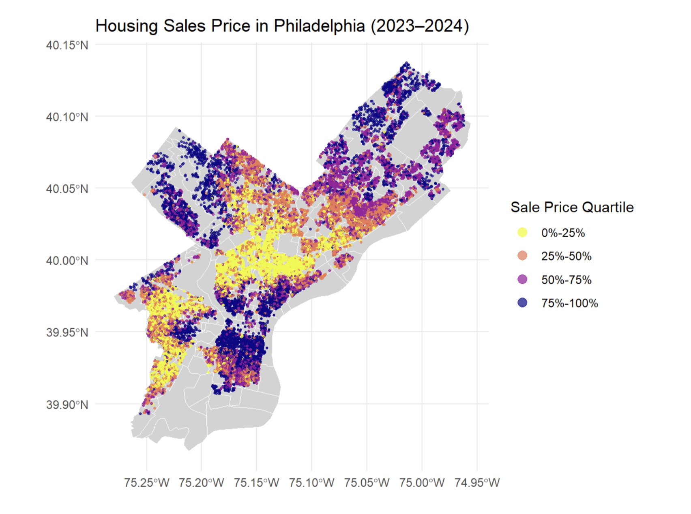
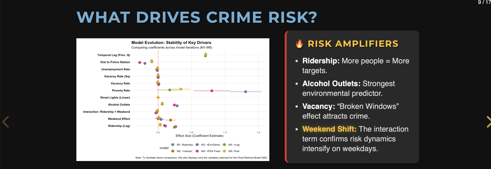
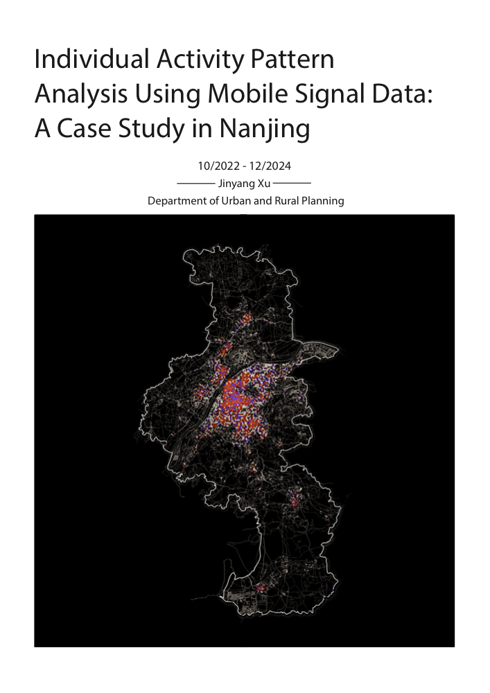

```{=html}
<div class="project-grid">

<a class="project-card" href="https://jyxu48.github.io/HCV-Dashboard_6.0/">
  <div class="project-img">
    
  </div>
  <h3>Mapping the U.S. Rental Subsidy</h3>
  <p>
    An interactive dashboard exploring Housing Choice Voucher patterns,
    rental subsidy data, and local demographic context.
  </p>
</a>

<a class="project-card" href="philadelphia-digital-row.html">
  <div class="project-img project-img-row-memo">
    
  </div>
  <h3>Operationalizing Digital ROW Management</h3>
  <p>
    A technical memo proposing trusted asset-state processes and standardized
    event workflows for Philadelphia's digital right-of-way data system.
  </p>
</a>

<a class="project-card" href="https://jyxu48.github.io/Satellite-Deep-Learning-project/">
  <div class="project-img">
    
  </div>
  <h3>Deep Learning and Remote Sensing</h3>
  <p>
    A Sentinel-2 land-cover segmentation workflow comparing Random Forest
    and U-Net models for downstream ecological habitat analysis.
  </p>
</a>

<a class="project-card" href="https://jyxu48.github.io/AI-for-Urban-Sustainability/">
  <div class="project-img">
    
  </div>
  <h3>Street-View Walkability AI</h3>
  <p>
    A computer vision pipeline for measuring pedestrian experience
    using Google Street View images, semantic segmentation, and LLMs.
  </p>
</a>

<a class="project-card" href="https://jyxu48.github.io/Jinyang_Xu_Python_Project_2025/">
  <div class="project-img">
    
  </div>
  <h3>Cuisine Influence Index</h3>
  <p>
    Quantifying neighborhood food culture using Yelp data,
    ACS indicators, and spatial clustering.
  </p>
</a>

<a class="project-card" href="https://jyxu48.github.io/Public-Policy_Analytics/Assignments/midterm/slides/Jinyang_Xu_appendix1.html">
  <div class="project-img">
    
  </div>
  <h3>Housing Price Modeling</h3>
  <p>
    Comparative analysis of OLS, spatial lag, and GWR models
    for urban housing markets.
  </p>
</a>

<a class="project-card" href="https://jyxu48.github.io/Public-Policy_Analytics/Final/Final_appendix.html">
  <div class="project-img">
    
  </div>
  <h3>Safe Passage: Modeling Crime Risk around SEPTA Bus Stops</h3>
  <p>
    Investigates the complex relationship between transit ridership and public safety around SEPTA bus stops in Philadelphia.
  </p>
</a>

<a class="project-card" href="mobile-signal-nanjing.pdf">
  <div class="project-img">
    
  </div>
  <h3>Individual Activity Pattern Analysis Using Mobile Signal Data</h3>
  <p>
    A case study in Nanjing using mobile signal data to analyze
    individual activity patterns and urban mobility behavior.
  </p>
</a>

</div>
```
